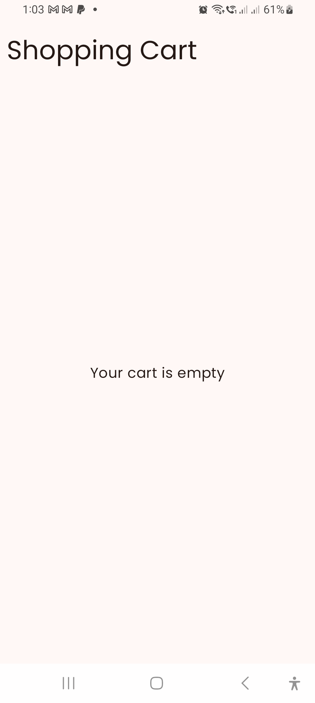

# SampleStoreApp

## Introduction
SampleStoreApp is a modern shopping application built using **Jetpack Compose** for UI and **Room Database** for local storage. The app provides a seamless and intuitive shopping experience, featuring product browsing, a shopping cart, a wishlist, and a secure checkout process.

## Features
- **Product Categories**: Browse items by category (TVs, Audio, Laptops, Mobile, Gaming, Appliances, etc.).
- **Shopping Cart**: Add and manage items before checkout.
- **Wishlist**: Save items for future purchases.
- **Checkout Process**: Complete purchases using Google Pay or PayPal.
- **User Authentication**: Secure login and registration.
- **Multi-language Support**: Translations available in English, German, Spanish, Italian, and Portuguese.
- **Dark and Light Mode Support**: Seamless theme switching for better user experience.
- **PayPal Sandbox Integration**: Test payment processing in a secure environment.

## Installation Guide

### Prerequisites

### Steps to Install and Run
1. **Clone the repository**:
```sh  
   https://github.com/MrMayTwenty/SampleStoreApp.git
```  
## Open the project in Android Studio:

1. Select **Open an existing project**.
2. Navigate to the cloned folder and open it.

## Create Secret Properties
1. Change Project View from **Android** to **Project**
2. Create `secret.properties` file
3. Add the following code
```
paypal_client_id:{request to agafrancisDroid@gmail.com}
paypal_client_secret:{request to agafrancisDroid@gmail.com}
```

## Sync Gradle:

- Android Studio will automatically prompt you to sync Gradle.
- If not, go to **File > Sync Project with Gradle Files**.

## Run the application:

1. Choose a device (**Emulator or Physical Device**).
2. Click on the **Run** button (`Shift + F10`).

## Configurations

- **Database Initialization**: The Room database initializes automatically when the app runs.
- **API Configurations**: If API integration is needed, update `BASE_URL` in `build.gradle.kts`

## Technologies Used

- **Kotlin** with **Jetpack Compose** for modern UI development.
- **Room Database** for local storage and efficient data handling.
- **Dagger Hilt** for dependency injection.
- **ViewModel & State** for state management.
- **UseCase Pattern** to structure business logic.
- **Retrofit** for networking (if APIs are used for product fetching).
- **Coroutines & Flow** for asynchronous processing.
### Notable Libraries

- **Navigation**: Jetpack Navigation for seamless screen transitions.
- **Coil**: Image loading with support for Jetpack Compose.
- **OkHttp Logging Interceptor**: Debugging network requests.
- **Kotlinx Serialization**: JSON parsing with Kotlin Serialization.
- **Security Crypto**: Secure data storage.
- **PayPal SDK**: Payment processing.
- **Google Fonts**: Custom typography integration.

## Screenshots

### Light Mode
Here are screenshots of the app in Light Mode:

  
  
  
  
  
  
  
  
  
  
  
  
  


### Dark Mode
Here are screenshots of the app in Dark Mode:

  
  
  
  
  
  
  
  
  
  
  
  
  


### Multi-Language Support
These screenshots show the app's multi-language feature:

#### Android Language Settings
  


#### App in Different Languages
**German (DE)**  


**Spanish (ES)**  


**Italian (IT)**  


**Portuguese (PT)**  
  
